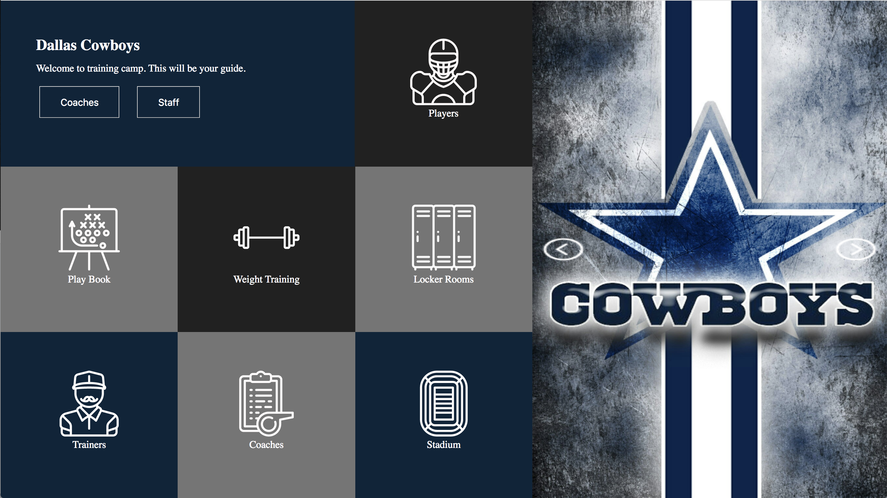

# EM-comp-challenge-1
I recreated a static comp that respects the integrity of the original design. 
I used flex box in order to make the static comp responsive. 
By adding media brakes I was able to reorganize elements to fit the page according to the pixel width of the screen. 
My theme for the static comp is an app that will help new Dallas Cowboys NFL players when they first get to training camp.

Static Comp Provided:

My Static Comp:

